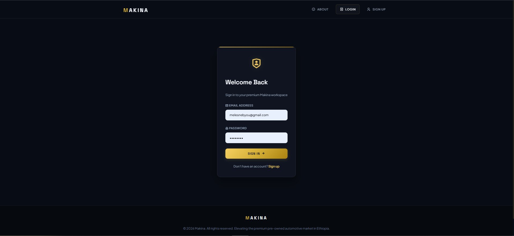

# MAKINA 🚗

> Ethiopia's premier automotive marketplace — buy and sell premium vehicles with ease.



## ✨ Features

### 🔐 Authentication
- User registration and login with role selection
- Session-based authentication
- Auto-redirect after login based on role

### 👤 Roles

| Role | Capabilities |
|------|-------------|
| **Admin** | View all users, block/unblock, delete accounts |
| **Seller** | Add, edit, delete car listings; manage profile & portfolio |
| **Customer** | Browse listings, search by brand/model/year, view car details & contact seller |

---

## 📸 Screenshots

### Sign Up


### Admin Dashboard


### Seller Profile


### Available Cars (Customer View)


### Car Details


---

## 🛠 Tech Stack

- **Backend:** PHP (MVC Architecture)
- **Database:** MySQL
- **Session Management:** PHP native sessions
- **Frontend:** PHP-rendered views

---

## 📁 Project Structure

```
├── index.php                  # Front controller / router
├── config/
│   └── Database.php           # Database connection
├── models/
│   ├── User.php
│   └── Car.php
├── controllers/
│   ├── AuthController.php
│   ├── AdminController.php
│   ├── SellerController.php
│   ├── CustomerController.php
│   └── PageController.php
└── views/
```

---

## 🚀 Getting Started

### Prerequisites
- PHP 7.4+
- MySQL
- Apache or Nginx (or PHP's built-in server)

### Installation

1. **Clone the repository**
   ```bash
   git clone https://github.com/your-username/makina.git
   cd makina
   ```

2. **Set up the database**
   - Create a MySQL database
   - Import the SQL schema file
   - Update `config/Database.php` with your credentials

3. **Run the app**
   ```bash
   php -S localhost:8000
   ```
   Open [http://localhost:8000](http://localhost:8000)

---

## 🔀 Routing

All requests go through `index.php` via `?action=` query parameter.

| Action | Description |
|--------|-------------|
| `login` | Login page |
| `signup` | Registration page |
| `adminUsers` | Admin: manage users |
| `sellerProfile` | Seller: view profile & listings |
| `sellerAddCar` | Seller: add a car |
| `sellerEditCar` | Seller: edit a car |
| `customerCars` | Customer: browse all cars |
| `carDetails` | Customer: view car details |
| `about` | About page |

---
## Contributing

Pull requests are welcome. For major changes, please open an issue first.

## 👨‍💻 Author

Built by [Nebyou](https://github.com/your-123neba)
